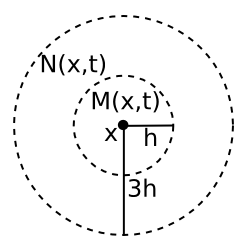

# Cellular automata
### Obsah
- [Úvod](#úvod)
- [Historie](#historie)
- [Conwayova hra života](#conwayova-hra-života)
- [Elementární CA](#elementární-ca)
- [Typy sousedství](#typy-sousedství)
- [Typy pravidel](#typy-pravidel)
- [Larger than life](#larger-than-life)
- [Constant addition](#constant-addition)
- [Smooth life](#smooth-life)
- [Multiple neighborhood CA](#multiple-neighborhood-ca)
- [Lenia](#lenia)
## Úvod
Cellular Automata (buněčné automaty, CA) jsou skupina modelů, ve kterých je prostor rozdělen do mřížky buněk. Každá z těchto buněk má svou vlastní hodnotu, například plná nebo prázdná. Tato mřížka se vyvíjí z daného základního uspořádání postupem času. Ten je rozdělen do iterací, kde každá iterace představuje jednotkový krok v čase. Během každé iterace vzniká nová generace buněk, přičemž stav každé buňky v této nové generaci je rozhodnut pomocí předem daných pravidel. Tyto pravidla určují, jak buňky budou vypadat v následující generaci. CA mohou vytvářet zajímavé a komplexní vzory pomocí i velmi jednoduchých pravidel.
## Historie
V 40. letech se John von Neumann snažil vytvořit sebereplikující mechanismy. Vytvořil první CA, ve kterém vytvořil von Neumannův universal constructor, který byl schopen sám sebe replikovat. V 70.letech John Conway vynalezl hru života, která je nejznámějším příkladem CA. V 80. letech Stephen Wolfram zkoumal jednorozměrná CA.

 <br>
*von Neumann universal constructor*
## Conwayova hra života
Conwayova hra života je nejznámějším příkladem CA. Jedná se o dvourozměrný totalistický CA, která se skládá z mřížky buněk. Každá buňka má dvě možné hodnoty, živá nebo mrtvá. Každá buňka rozhodne svou hodnotu v příští iteraci pomocí hodnot 8 sousedících buněk.
### Pravidla
- Živá buňka s méně než dvěma živými sousedy zemře.
- Živá buňka s více než třemi živými sousedy zemře.
- Živá buňka s dvěma nebo třemi živými sousedy přežije.
- Mrtvá buňka s právě třemi živými sousedy oživne.
### Příklady
**Blinker** - Jednoduchý oscilátor


**Glider** - Nejmenší pohybující se vzor v hře života.


**Glider gun** - Mechanismus vytvářející glidery.


**Life in life** - Hra života ve hře života.


## Elementární CA
Nejzákladnější skupina CA. Je jednorozměrná a může mít 2 stavy, 0 nebo 1. Každá buňka má 2 sousedy, ale k určení příští iterace se započítává i aktuální buňka. Je 8 možných uspořádání pro každou buňku a její sousedy:
```
111 110 101 100 011 010 001 000
```
ke každému z tě těchto uspořádání je přiřazen jeden bit, který určuje hodnotu buňky v příští iteraci. Z těchto bitů se udělá jedno číslo v desítkové soustavě. Například:
```
111 110 101 100 011 010 001 000
 0   1   1   0   1   1   1   0
pravidlo 01101110 = 110
```
Toto pravidlo se aplikuje na každou buňku v iteraci a vytvoří se nová generace buněk. Tento proces se opakuje až do zastavení nebo do nekonečna. Celkem je 256 různých možných pravidel.

 <br>
https://rreusser.github.io/rule-30/ <br>
*příklady elementárních CA*

## Typy sousedství
### Von Neumannovo sousedství
Je jedno z nejstarších sousedství. Obsahuje všechny buňky jejichž manhattanská vzdálenost je menší nebo rovna požadovaného poloměru. Každá buňka má 4 sousedy, 2 vodorovně a 2 svisle. Základně má poloměr 1.

 <br>
### Mooreovo sousedství
Toto sousedství je používáno například v Conwayově hře života. Je to čtverec o straně 2r+1, kde r je poloměr. Každá buňka má 8 sousedů. Lze ho také rozšířit.

 <br>

### Kruhové sousedství
Je to kruh o poloměru r.

 <br>

## Typy pravidel
### Totalistická pravidla
Pro určení příští generace se používá součet hodnot (nebo průměr hodnot) buněk v sousedství. Pro Mooreovo sousedství a 2 hodnoty buňky je tedy možných 2<sup>9</sup> = 512 pravidel.
#### Notace
Pravidlo se zapisuje jako řada čísel, kde každý prvek řady je součet hodnot v sousedství pro který bude v příští iteraci buňka živá. Například pravidlo ```2479``` zname, že buňka bude živá pokud bude mít součet buňek v sousedství 2, 4, 7 nebo 9.
### Vnější totalistická pravidla
Pro určení příští generace se používá součet hodnot buněk v sousedství a hodnota aktuální buňky. Tento typ se používá například v Conwayově hře života, často se této skupině říká life-like. Pro Mooreovo sousedství a 2 hodnoty buňky je tedy možných 2<sup>18</sup> = 262144 pravidel.
#### Notace
Pravidlo se zapisuje ve formátu ```B[0-9]/S[0-9]```, kde B jsou počty živých buněk potřebných k oživení mrtvé buňky(birth) a S jsou počty živých buněk potřebných k přežití živé buňky(survival). Pro vyšši poloměry se čísla oddělují čárkou.Například Conwayova hra života má pravidlo ```B3/S23```.
### Netotalistická pravidla
Tento typ má pro každou možnou kombinaci buněk přiřazenou výslednou hodnotu buňky v příští generaci. To znamenná že na rozdíl od totalistických záleží i na uspořádání buňěk. Většinou se předpokládá že CA je osově i bodově souměrný, ale nemusí být. Tento typ se používá například u elementárních CA. Pro Mooreovo sousedství, 2 hodnoty buňky a symetrii je tedy možných 2<sup>102</sup> pravidel.
## Larger than life
Tento CA byl vyvinut v roce 1996 Kellie Michel Evansovou. Funguje velmi podobně jako Conwayova hra života, používá ale rozšířené Mooreovo nebo van Neumannovo sousedství. Je to higher range outer totalistic (HROT) CA, s tím omezením že počty buňek potřebné pro přežití a oživení jsou rozsahy.
### HROT Notace
Pravidlo se zapisuje ve formátu ```Rr, Cc, Ssrange, Bbrange, Nn```.
- R - poloměr sousedství
- C - počet možných stavů buňky
- S - rozsah počtu sousedů pro přežití
- B - rozsah počtu sousedů pro oživení
- N - druh sousedství, pokud není uvedeno tak se použije Mooreovo sousedství

**Bosco’s rule** ```R5, C2, R33-57, B34-45``` 

 <br>
## Constant addition
Constant addition je 1D CA s plynulou hodnotou, což znamená že hodnota buňky může být jakákoliv v intervalu <0, 1>. Sousedství zahrnuje aktuální buňku a dvě sousedící. Každou iteraci se vypočítá průměr hodnot v sousedství, ke kterému se přičte konstanta. Pokud bude součet větší než 1, tak se odečte 1. Výsledná hodnota bude hodnota buňky v příští iteraci.


## Smooth life
Smooth life je generalizace Conwayovy hry života na plynulý prostor. Podobně jako u CGOL se používá vnější totalistické pravidlo. Narozdíl od CGOL ale pro rozhodnutí stavu buňky v příští iteraci se nerpočítá s jednou buňkou na kterou se díváme a jejími 8 sousedy, ale s buňkami ve dvou koncentrických kruzích. Vnější je zhruba 3x větší než vnitřní. V obou oblastech se vypočítají průměry hodnot oblasti. Hodnota buňky v příští oblasti se určí pomocí tranziční funkce, která je závislá na průměru hodnot v obou oblastech.

 <br>
*Oblasti v Smooth life*

 <br>
*Pro porovnání diskrétní tranziční funkce v CGOL*

 <br>
*Příklad: průměr vnitřního průměru je 0.7, vnějšího 0.4. Podle tranziční funkce je výsledek 1 (je v červené oblasti)*

Častým rozšířením Smooth life je Smooth life s plynulou hodnotou. Funguje v podstatě stejně, ale tranziční funkce může mít výsledek mezi 0 a 1. Tato funkce má stejný tvar jako u Smooth life, ale na okrajích není schod, ale pomalu přechází z 0 na 1.

 <br>
*Příklad: průměr vnitřního průměru je 0.8, vnějšího 0.3. Podle tranziční funkce je výsledek zhruba 0.55*

https://www.youtube.com/watch?v=KJe9H6qS82I

## Multiple neighborhood CA
Tato skupina byla vynalezena v roce 2014. Jak název napovídá, tyto CA využívají několik sousedství. Každé sousedství má alepoň jednu aktualizující funkci. Funkce se aplikuje postupně, takže záleží na pořadí v jakém jsou. například tady je 6 aktualizačích funkcí pro 2 sousedství:
```
if( nh0 >= 0.210	&& nh0 <= 0.220 ) { world[x][y] = 1.0; }
if( nh0 >= 0.350	&& nh0 <= 0.500 ) { world[x][y] = 0.0; }
if( nh0 >= 0.750	&& nh0 <= 0.850 ) { world[x][y] = 0.0; }
if( nh1 >= 0.100	&& nh1 <= 0.280 ) { world[x][y] = 0.0; }
if( nh1 >= 0.430	&& nh1 <= 0.550 ) { world[x][y] = 1.0; }
if( nh0 >= 0.120	&& nh0 <= 0.150 ) { world[x][y] = 0.0; }
```
výsledkem je příští iterace.
Tyto funkce s těmito sousedstvími:


vytvoří toto:


Jiný příklad:


## Lenia
Lenia je totalistícký CA s plynulým světem, časem i hodnotou. V základní podobě je sousedství rozmazaný kruh, který má hodnoty mezi 0 a 1. Udělá se konvoluce mezi tímto sousedstvím a světem. Hodnoty z této knvoluce se dají do růstové funkce, která vrací hodnoty mezi -1 a 1. Tyto hodnoty se vynásobí časovým krokem, třeba 0.1, a přičtou se k poslední hodnotě buňky. Výsledná hodnota se ořízne na interval <0, 1>. Tato hodnota se použije jako hodnota buňky v příští iteraci.
Tento CA je schopný vytvářet velmi komplexní vzory.

 <br>
*základní sousedství (konvoluční matice)*

 <br>
*příklad růstové funkce*

 <br>
*Orbium, neiznámější vzor v Lenii*

### Multi-ring Lenia
Multi-ring Lenia je varianta Lenie, ve které má konvoluční matice více kruhů. Tyto kruhy jsou od sebe stejně vzdálené, ale mají různé síly. Vzory vytvořené touto variantou jsou více zajímavé a méně stabilní.

 <br>
*Příklad matice s více kruhy*


### Multi-kernel Lenia
Tato varianta funguje na podobném principu jako MNCA, ale každé sousedství má jen jednu růstovou funkci. Výsledná hodnota buňky je průměr hodnot z těchto funkcí. Lze kombinovat s multi-ring. Tyto vzory se často pohybují do náhodných směrů a jsou velmi individuální.

 <br>
*Multi-kernel Lenia*

### Multi-channel Lenia
Tady jsou 3 "látky", která má každá zvlášť svoje pravidla. Nemůžou se navzájem měnit, ale mohou se ovlivňovat. Když se vypočítává konvoluce tak se do ní počítají všechny kanály, ale každý se aktualizuje zvlášť podle své kovoluční matice a růstové funkce. Kanálů může být libovolný počet. První tři kanály se typicky zobrazují jako R, G, B. 

 <br>
*3 kanály a 3 kernely*

### ND Lenia
Lenia není limitovaná jen na 2 rozměry. S více rozměry se ale velmi rychle zvyšuje výpočetní náročnost (O(n<sup>6</sup> )pro 3D oproti O(n<sup>4</sup>) pro 2D). Také jsou zajímavé vzory mnohem méně časté a těžší najít.

 <br>
*3D Lenia*
Jsou i další variace Lenie, například particle lenia, flow lenia, asypmtotická lenie, a další.

## Zdroje
- https://en.wikipedia.org/wiki/Cellular_automaton
- https://en.wikipedia.org/wiki/Conway%27s_Game_of_Life
- https://en.wikipedia.org/wiki/Elementary_cellular_automaton
- https://content.wolfram.com/uploads/sites/34/2020/07/two-dimensional-cellular-automata.pdf
- https://slackermanz.com/understanding-multiple-neighborhood-cellular-automata/
- https://0fps.net/tag/smooth-life/
- https://www.youtube.com/watch?v=KJe9H6qS82I
- https://chakazul.github.io/lenia.html
- https://www.youtube.com/watch?v=HT49wpyux-k
- https://www.youtube.com/watch?v=6kiBYjvyojQ
- https://demonstrations.wolfram.com/ConstantAdditionContinuousCellularAutomaton/
